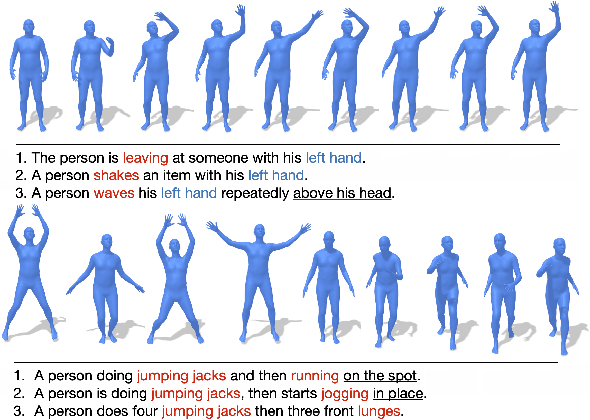

# <b>HumanML3D: 3D Human Motion-Language Dataset</b>
<!--  -->

HumanML3D is a 3D human motion-language dataset that originates from a combination of [HumanAct12](https://github.com/EricGuo5513/action-to-motion) and [Amass](https://github.com/EricGuo5513/action-to-motion) dataset. It covers a broad range of human actions such as daily activities (e.g., 'walking', 'jumping'), sports (e.g., 'swimming', 'playing golf'), acrobatics (e.g., 'cartwheel') and artistry (e.g., 'dancing'). 

    
  

### Statistics
Each motion clip in HumanML3D comes with 3-4 single sentence descriptions annotated on Amazon Mechanical Turk. Motions are downsampled into 20 fps, with each clip lasting from 2 to 10 seconds. 

Overall, HumanML3D dataset consists of **14,616** motions and **44,970** descriptions composed by **5,371** distinct words. The total length of motions amounts to **28.59** hours. The average motion length is **7.1** seconds, while average description length is **12** words.

## Download Data

## Installation

## Process Data

## Animate Data
